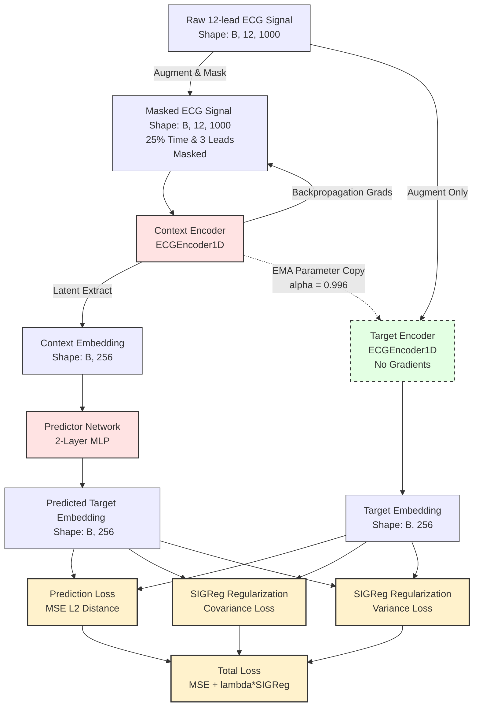

# 🎨 CardioRep: Visual Architecture Blueprint & Core Dynamics

This document provides a highly detailed visual guide and architectural blueprint of the **CardioRep** platform, detailing exact tensor shapes, block transitions, data flows, and training loops for both pretraining and clinical inference.

---

## 🏗️ 1. CardioRep 1D ResNet Encoder Architecture (`ECGEncoder1D`)

The 1D ResNet maps multi-channel temporal traces to a compact latent embedding space.

```text
       Input ECG Waveform (Clean or Masked)
             Shape: [B, 12, 1000] (12 Leads, 10 Seconds @ 100Hz)
                       │
                       ▼
    ┌──────────────────────────────────────────────┐
    │  Initial Convolution (Wide Receptive Field)  │  - Conv1d (in=12, out=64, k=15, stride=2, pad=7)
    │  BatchNorm1d + ReLU                          │  - Captures local waves (QRS, P, T)
    └──────────────────────────────────────────────┘
                       │
                       ▼  Shape: [B, 64, 500] (Filters=64, Length=500)
    ┌──────────────────────────────────────────────┐
    │  ResNet Stage 1 (2 Residual Blocks)          │  - Downsamples temporal resolution
    │  Stride = 2 (Block 1), Stride = 1 (Block 2)  │  - Channel projection via 1x1 Conv shortcut
    └──────────────────────────────────────────────┘
                       │
                       ▼  Shape: [B, 128, 250] (Filters=128, Length=250)
    ┌──────────────────────────────────────────────┐
    │  ResNet Stage 2 (2 Residual Blocks)          │  - Downsamples temporal resolution
    │  Stride = 2 (Block 1), Stride = 1 (Block 2)  │  - Extracts medium-range temporal patterns
    └──────────────────────────────────────────────┘
                       │
                       ▼  Shape: [B, 256, 125] (Filters=256, Length=125)
    ┌──────────────────────────────────────────────┐
    │  ResNet Stage 3 (2 Residual Blocks)          │  - Downsamples temporal resolution
    │  Stride = 2 (Block 1), Stride = 1 (Block 2)  │  - Captures global morphology & rhythm patterns
    └──────────────────────────────────────────────┘
                       │
                       ▼  Shape: [B, 512, 63] (Filters=512, Length=63)
    ┌──────────────────────────────────────────────┐
    │  Global Average Pooling (AdaptiveAvgPool1d) │  - Compresses temporal dimension entirely
    │  Squeeze Output Channel                      │  - Shape becomes [B, 512]
    └──────────────────────────────────────────────┘
                       │
                       ▼  Shape: [B, 512]
    ┌──────────────────────────────────────────────┐
    │  Latent Projection (nn.Linear)               │  - Projects features to final latent space
    │  No activation (Linear Bottleneck)           │  - Shape becomes [B, 256]
    └──────────────────────────────────────────────┘
                       │
                       ▼
            Latent Representation Vector (z)
                 Shape: [B, 256]
```

---

## 🧠 2. CardioRep Joint-Embedding Predictive Architecture (JEPA) Pretraining

In the self-supervised pretraining loop, we train the **Context Encoder** and the **Predictor** to reconstruct missing physical segments, while the **Target Encoder** parameters are updated via Exponential Moving Average (EMA).



---

## 📋 3. CardioRep Supervised Baseline & Clinical Decision Support Pipeline

When a raw ECG is uploaded, it passes through sequential physical validation, latent extraction, risk triage scoring, vector-based similarity case matching, and Integrated Gradients saliency mapping.

```text
                       [ Raw ECG Upload ]
                               │
                               ▼
            ┌──────────────────────────────────────┐
            │   Physical Signal Quality Check      │  - Detect Flatline/Detachment (Var < 1e-5)
            │   (Clinical QA Filter)               │  - Detect Voltage Saturation (|X| > 5.0mV)
            └──────────────────────────────────────┘
                               │
                ┌──────────────┴──────────────┐
                ▼ (If Passed QA)              ▼ (If Failed QA)
      [ Process Waveform ]              [ Reject Waveform ]
         Shape: [12, 1000]                 Output: QA Error Report
                │
                ├───► [ CardioRep 1D Feature Extractor ] ──► Latent Vector (z): [256]
                │                                                    │
                │                                                    ├───► [ Vector DB Cosine Similarity Search ]
                │                                                    │     Returns: Top-3 historical matches
                │                                                    │     with diagnosed clinical findings
                │                                                    │
                ├───► [ Downstream Classifier ]                      ▼
                │     Shape: nn.Linear(256, 5)            [ Patient Embedding Database ]
                │     Outputs: Probabilities NORM, MI,        (17,441 training profiles)
                │              STTC, CD, HYP
                │              │
                │              ▼
                │     [ Abnormality Risk Score ] ──► Triage Status: NORMAL vs. REQUIRES REVIEW
                │
                ▼
      ┌──────────────────────────────────────┐
      │  Integrated Gradients Saliency Engine │  - Computes path gradients over 10 steps
      │  (Target: Max Probability Class)      │  - Yields saliency map of shape [12, 1000]
      └──────────────────────────────────────┘
                               │
                               ├─► Lead Attribution: Sum(Abs(Grads), dim=1) -> Lead Importance List
                               │
                               └─► Temporal Saliency: Sum(Abs(Grads), dim=0) -> High-influence seconds
                               │
                               ▼
                [ Structured Clinical Report ]
                - Triage Decision Status
                - Pathology Probabilities
                - Top-3 Retried Matching Cases
                - Highlighted Leads & Time intervals
```

---

## 🛠️ 4. The Diagnostic Holy Trinity: Preventing Representation Collapse

CardioRep's self-supervised pretraining relies heavily on keeping the representation space high-dimensional. The mathematical formulations of the metrics plotted on the dashboard are:

1. **Effective Rank ($e^H$)**:
   Given representation matrix $Z \in \mathbb{R}^{B \times D}$, let $\sigma_1, \sigma_2, \dots, \sigma_k$ be its singular values. Let $p_i = \sigma_i / \sum_j \sigma_j$.
   $$\text{Effective Rank} = \exp\left(-\sum_i p_i \ln(p_i)\right)$$
   *Significance*: Measures the active dimensionality. If this approaches 1, the embeddings collapse into a 1D line. Target: $\ge 60.0$.

2. **Feature Standard Deviation (`feature_std`)**:
   $$\text{Feature Std} = \frac{1}{D}\sum_{j=1}^D \sqrt{\text{Var}(z_j)}$$
   *Significance*: Measures active feature variation. If this collapses to 0, every dimension has the same constant value across the batch. Target: $\ge 0.5$.

3. **Pairwise Cosine Similarity (`pairwise_cosine`)**:
   Let $\tilde{z}_i = z_i / \|z_i\|_2$ be the L2-normalized representations.
   $$\text{Pairwise Cosine} = \frac{2}{B(B-1)} \sum_{i < j} \tilde{z}_i \cdot \tilde{z}_j$$
   *Significance*: Measures embedding crowding. If this is near 1.0, all samples are pointing in the exact same direction (point collapse). Target: $\le 0.1$.
